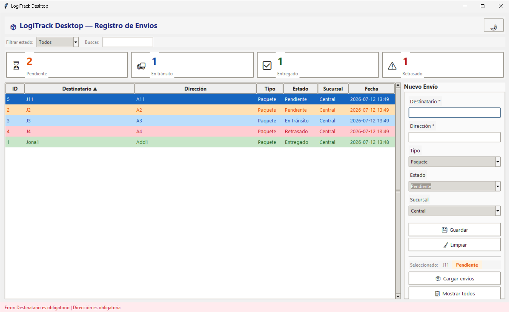
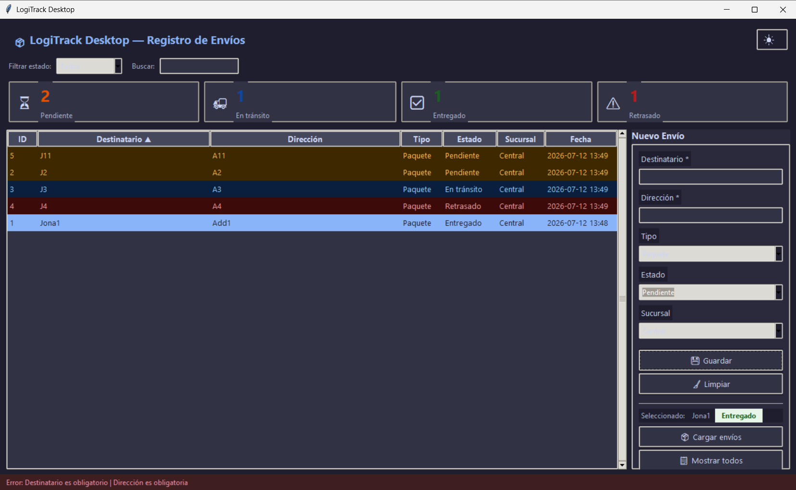

# 📦 LogiTrack Desktop

> Aplicación de escritorio para registro y seguimiento de envíos logísticos, con persistencia SQLite y enriquecimiento de rutas por API.

---

## Hero

| Modo claro | Modo oscuro |
|:---:|:---:|
|  |  |

---

## ¿Por qué importa?

Los operadores de sucursales necesitan una herramienta que funcione sin conexión estable, que no requiera configuración de servidores y que centralice el registro de envíos con trazabilidad completa. LogiTrack Desktop se instala como un ejecutable único, persiste los datos localmente en SQLite, y enriquece cada envío con geocodificación y clima de la ruta cuando hay red — encolando las operaciones fallidas para sincronizarlas después.

---

## Arquitectura

```
┌──────────────────────────────────────────────────────────┐
│                      logitrack/                          │
│                                                          │
│  views/           controllers/     services/   models/   │
│  ┌────────────┐   ┌────────────┐  ┌─────────┐  ┌──────┐ │
│  │ MainWindow │──▶│ EnvioCtrl  │─▶│ EnvioSvc│  │Envio │ │
│  │ components │   │ TaskWorker │  │ SQLiteR │  └──────┘ │
│  │ ScrollFrame│   └────────────┘  │ MemoryR │           │
│  └────────────┘                   │ RouteAPI│           │
│        │                          └────┬────┘           │
│        │                               │                │
│    ttk.Style                    logitrack.db             │
│    tema claro/oscuro            (SQLite 3 + WAL)         │
│                                        │                │
│                               Nominatim · Open-Meteo    │
└──────────────────────────────────────────────────────────┘

Regla de dependencia: views → controllers → services → models
Las vistas nunca importan modelos directamente (verificado por tests AST).
```

---

## Quickstart

```bash
# 1. Clonar y entrar al proyecto
git clone https://github.com/JonathanAldanaHerrera/ProyectoIntegradorPythonSSR-001.git
cd ProyectoIntegradorPythonSSR-001

# 2. Setup del entorno (crea .venv e instala dependencias)
./scripts/setup.sh        # macOS / Linux
scripts\setup.bat         # Windows

# 3. Activar entorno y ejecutar
source .venv/bin/activate
python -m logitrack
```

> El archivo `logitrack.db` y el log `logitrack.log` se crean automáticamente en la raíz del proyecto al primer arranque.

---

## Ejecutable precompilado

Los ejecutables para macOS y Windows están disponibles en la sección [**Releases**](../../releases) del repositorio.

| Plataforma | Archivo | Instrucciones |
|------------|---------|---------------|
| macOS | `LogiTrack.app` | Descomprimir y ejecutar directamente |
| Windows | `LogiTrack/LogiTrack.exe` | Descomprimir y ejecutar `LogiTrack.exe` |

Para compilar tú mismo:

```bash
./scripts/build.sh      # macOS / Linux
scripts\build.bat       # Windows
```

---

## Tabla de tecnologías

| Tecnología | Versión | Uso |
|------------|---------|-----|
| Python | 3.12 | Lenguaje principal |
| Tkinter / ttk | stdlib | Framework de UI |
| SQLite 3 | stdlib | Persistencia local |
| requests | ≥ 2.31 | Llamadas HTTP a APIs externas |
| Nominatim (OSM) | — | Geocodificación de direcciones |
| Open-Meteo | — | Datos de clima por coordenadas |
| PyInstaller | ≥ 6.0 | Empaquetado a ejecutable |
| pytest | ≥ 7.4 | Tests automatizados |

---

## Cómo correr los tests

```bash
# Todos los tests
python -m pytest tests/ -v

# Solo tests de arquitectura
python -m pytest tests/unit/ -v

# Con reporte de cobertura (requiere pytest-cov)
python -m pytest tests/ --cov=logitrack --cov-report=term-missing
```

Los tests de arquitectura verifican mediante análisis AST que ninguna vista importe modelos directamente, y que los servicios no dependan de vistas ni controladores.

---

## Roadmap futuro

- [ ] Autenticación por usuario y rol (operador / supervisor)
- [ ] Validación de dirección contra Nominatim antes de guardar
- [ ] Tests de integración contra BD SQLite en memoria (`tests/integration/`)
- [ ] Soporte multi-sucursal con API REST central
- [ ] Notificaciones al destinatario (email / SMS) por cambio de estado
- [ ] Dashboard analítico de KPIs históricos desde tabla `logs`
- [ ] Actualizaciones automáticas (Sparkle / NSIS)
- [ ] Migración opcional a PostgreSQL (el patrón repositorio ya lo permite)

---

## Estructura del proyecto

```
ProyectoIntegradorPythonSSR-001/
├── logitrack/
│   ├── models/          # Dataclasses (Envio)
│   ├── services/        # Lógica de negocio, repositorios, cliente API
│   ├── controllers/     # Coordinadores y TaskWorker
│   ├── views/           # Ventana principal y componentes visuales
│   ├── ui/              # Sistema de temas ttk
│   ├── logger.py        # Configuración de logging
│   ├── paths.py         # Resolución de rutas dev/frozen
│   └── app.py           # Punto de entrada y contenedor DI
├── tests/
│   ├── unit/            # Tests de arquitectura y contratos
│   └── integration/     # (próximamente) Tests contra BD real
├── docs/
│   ├── 00-fundamentos.md … 07-empaquetado.md   # Documentación por fase
│   ├── 08-self-review.md                        # Autoevaluación de lecciones
│   └── EXECUTIVE_SUMMARY.md                     # Informe ejecutivo
├── scripts/
│   ├── setup.sh / setup.bat    # Setup del entorno de desarrollo
│   └── build.sh / build.bat / build.spec  # Compilación con PyInstaller
├── requirements.txt
├── requirements-dev.txt
├── pyproject.toml
└── LICENSE
```

---

## Licencia y autor

Distribuido bajo licencia **MIT**. Ver [LICENSE](LICENSE) para detalles.

**Autor:** Jonathan Aldana — [jonathan.aldana170500@gmail.com](mailto:jonathan.aldana170500@gmail.com)
