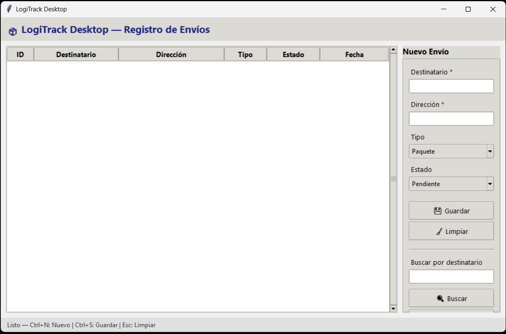

# Fase 2 — Ventana principal y widgets básicos

## Descripción

Ventana funcional de LogiTrack Desktop donde el despachador puede registrar envíos en memoria y verlos listados en una tabla. La interfaz se divide en 4 zonas principales:

| Zona | Descripción |
|------|-------------|
| **Barra superior** | Título de la aplicación con icono |
| **Área central** | Tabla `Treeview` con columnas: ID, Destinatario, Dirección, Tipo, Estado, Fecha |
| **Panel lateral** | Formulario de alta con campos, combos y botones + sección de búsqueda |
| **Barra de estado** | Mensajes dinámicos con colores según el contexto (éxito/error/normal) |

## Widgets utilizados

| Widget | Propósito |
|--------|-----------|
| `tk.Tk` | Ventana raíz de la aplicación |
| `ttk.Frame` | Contenedores para organizar zonas |
| `ttk.Label` | Etiquetas de campos y título |
| `ttk.Entry` | Campos de entrada de texto (destinatario, dirección, búsqueda) |
| `ttk.Combobox` | Selectores desplegables (tipo de envío, estado) |
| `ttk.Button` | Acciones: Guardar, Limpiar, Buscar, Mostrar todos |
| `ttk.Treeview` | Tabla de envíos con múltiples columnas |
| `ttk.Scrollbar` | Scroll vertical para la tabla |
| `ttk.LabelFrame` | Marco con título para el formulario |
| `ttk.Separator` | Separador visual entre formulario y búsqueda |

## Validación

- **Destinatario** y **Dirección** son campos obligatorios (marcados con `*`).
- Si se intenta guardar con campos vacíos, la barra de estado muestra un mensaje de error en rojo.
- Al registrar exitosamente, la barra de estado muestra confirmación en verde.

## Atajos de teclado

| Atajo | Acción |
|-------|--------|
| `Ctrl+N` | Poner foco en el campo Destinatario (iniciar alta) |
| `Ctrl+S` | Guardar el envío actual |
| `Esc` | Limpiar todos los campos del formulario |

## Ejecución

```bash
python -m logitrack
```

## Estructura de archivos de la fase

```
logitrack/
├── __init__.py
├── __main__.py              ← punto de entrada
├── app.py                   ← bootstrap + inyección de dependencias
├── models/
│   └── envio.py             ← dataclass Envio
├── views/
│   └── main_window.py       ← ventana principal con todos los widgets
├── controllers/
│   └── envio_controller.py  ← lógica de alta, búsqueda, validación
└── ui/
    └── theme.py             ← configuración de tema con ttk.Style
```

## Screenshot

