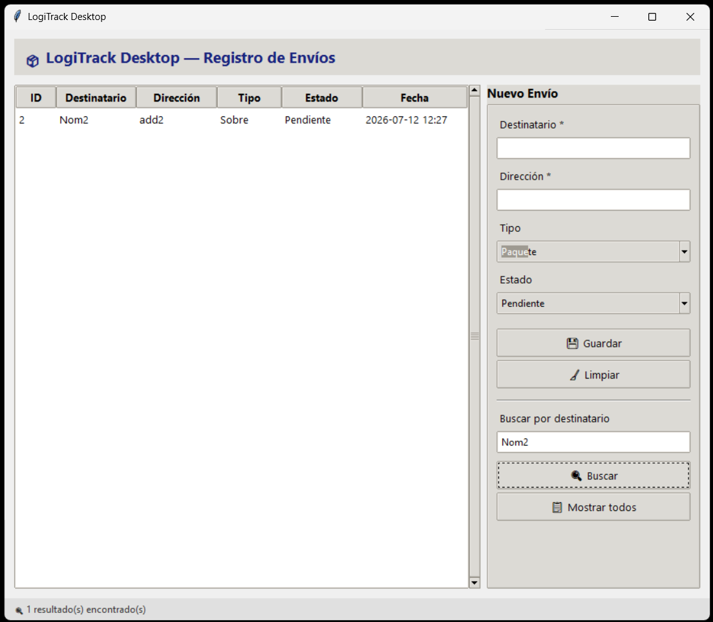
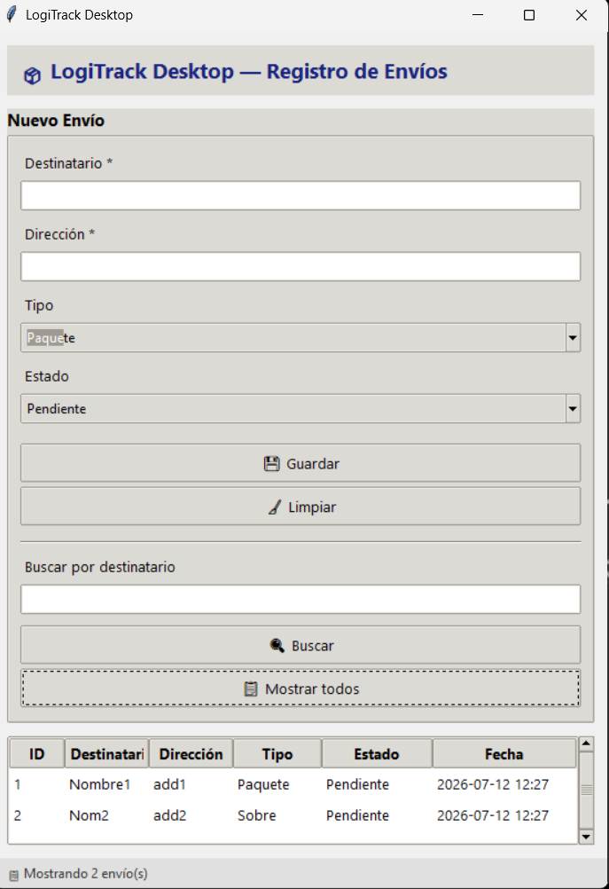
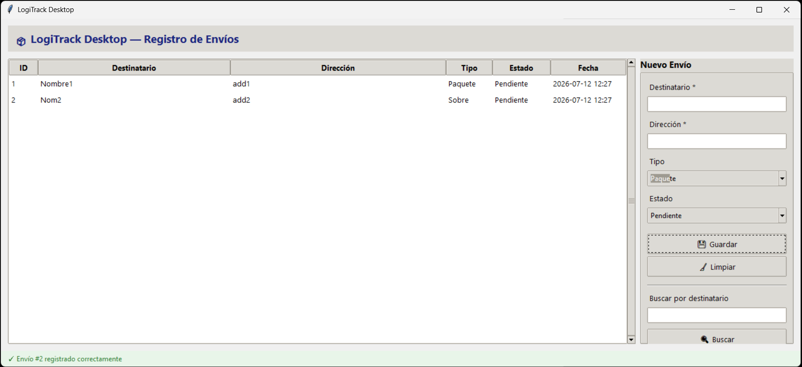

# Fase 3 — Geometría y layouts

## Estrategia de geometría

La ventana usa exclusivamente `grid()` como layout manager. La distribución se basa en un sistema de **weights** que define qué zonas se expanden y cuáles mantienen tamaño fijo.

### Grid principal del root

```
         columna 0 (weight=1)    columna 1 (weight=0, min=280px)
        ┌────────────────────────┬──────────────────┐
 row 0  │ Barra superior (colspan=2)                │  weight=0
        ├────────────────────────┼──────────────────┤
 row 1  │ Tabla Treeview         │ Panel formulario │  weight=1
        │ (se expande)           │ (ancho fijo)     │
        ├────────────────────────┴──────────────────┤
 row 2  │ Barra de estado (colspan=2)               │  weight=0
        └───────────────────────────────────────────┘
```

### Comportamiento al redimensionar

| Acción | Resultado |
|--------|-----------|
| Agrandar horizontalmente | La tabla crece, el panel lateral mantiene ~280px |
| Agrandar verticalmente | La tabla crece, barras superior/inferior fijas |
| Encoger horizontalmente | La tabla se reduce, el panel mantiene su mínimo |
| Encoger < 700px | **Responsive**: el formulario pasa arriba de la tabla |

Tamaño mínimo de ventana: **500×400px** (configurado en `app.py`), permite llegar al umbral responsive de 700px.

### Layout responsive (< 700px)

```
         columna 0 (weight=1)
        ┌───────────────────────┐
 row 0  │ Barra superior        │  weight=0
        ├───────────────────────┤
 row 1  │ Panel formulario      │  weight=0
        ├───────────────────────┤
 row 2  │ Tabla Treeview        │  weight=1
        │ (se expande)          │
        ├───────────────────────┤
 row 3  │ Barra de estado       │  weight=0
        └───────────────────────┘
```

La transición se detecta con `bind("<Configure>")` y un flag `_layout_horizontal` que evita recalcular en cada píxel de movimiento.

## Sistema de espaciados

Todos los paddings usan múltiplos de 4px definidos en `ui/theme.py`:

| Constante | Valor | Uso |
|-----------|-------|-----|
| `PAD_SM` | 4px | Entre label y entry |
| `PAD_MD` | 8px | Entre campos, separadores |
| `PAD_LG` | 12px | Márgenes de zonas principales |
| `PAD_XL` | 16px | Padding interno del formulario |

## Treeview — Columnas auto-stretch

| Columna | Ancho base | Stretch |
|---------|-----------|---------|
| ID | 50px | No |
| Destinatario | 160px | Sí |
| Dirección | 200px | Sí |
| Tipo | 80px | No |
| Estado | 100px | No |
| Fecha | 130px | No |

Solo Destinatario y Dirección se expanden proporcionalmente con el espacio disponible.

## Capturas de redimensionamiento

*Layout en tamaño pequeño - Screenshot*

*Layout en tamaño mediano - Screenshot*


*Layout en tamaño maximizado - Screenshot*


## Archivos modificados

| Archivo | Cambio |
|---------|--------|
| `views/main_window.py` | Refactor completo: grid puro, weights, responsive |
| `ui/theme.py` | Constantes de espaciado y umbrales |
| `app.py` | `minsize(500, 400)` para permitir redimensionamiento al umbral responsive |
